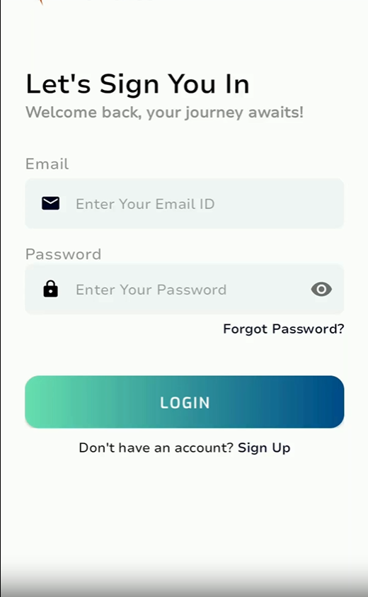
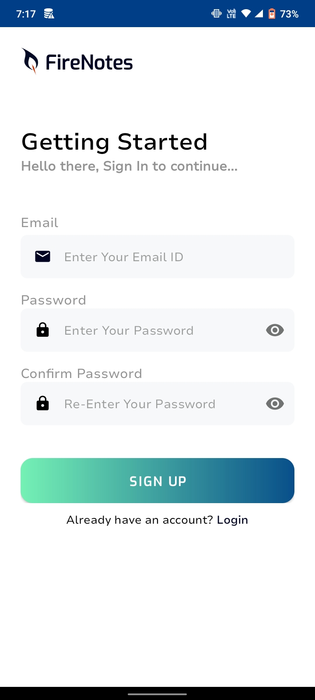
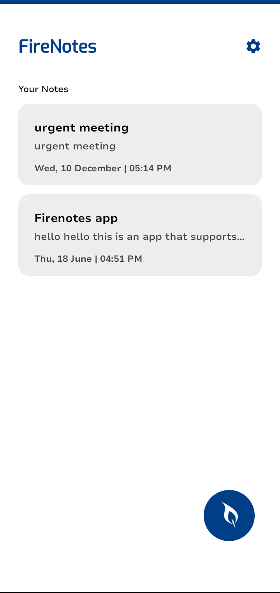
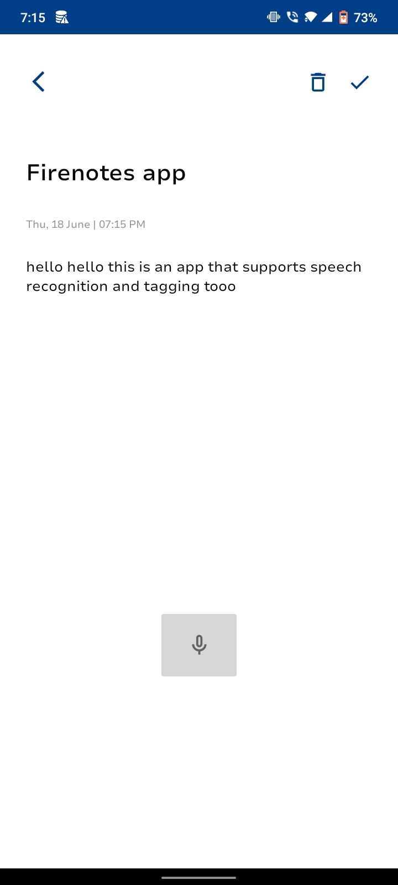
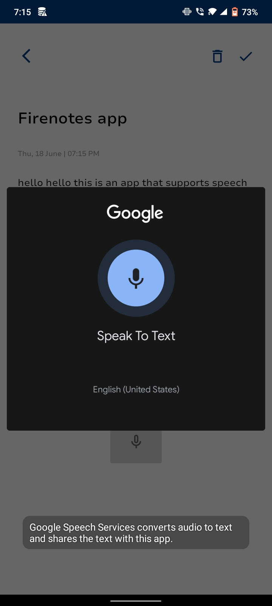

# FireNotes 📝

A modern Android note-taking application built with Java and Firebase Cloud Firestore. FireNotes allows users to securely create, manage, organize, and synchronize notes in real-time. The application also includes Speech-to-Text note creation and a Tagging System for improved productivity and note organization.


---

## ✨ Features

* 🔐 Firebase Authentication
* 📝 Create, Edit & Delete Notes
* ☁️ Real-Time Cloud Synchronization
* 🎤 Speech-to-Text Note Creation
* 🏷️ Tag-Based Note Organization
* 🔄 Password Reset Support
* 📱 Clean and Responsive Android UI
* 🔒 User-Specific Secure Data Storage

---

## 🛠️ Tech Stack

### Android Development

* Java
* Android SDK
* XML Layouts
* Material Components

### Backend & Database

* Firebase Authentication
* Firebase Cloud Firestore

### Libraries & APIs

* FirebaseUI
* Lottie Animations
* Android Speech Recognition API

---

## 📂 Project Structure

```text
FireNotes/
├── app/
├── gradle/
├── docs/
│   └── screenshots/
├── README.md
├── build.gradle
├── settings.gradle
├── gradle.properties
└── .gitignore
```

## 📸 Screenshots

<table>
<tr>
<td align="center">
<br>
<b>Login Screen</b>
</td>

<td align="center">
<br>
<b>Registration Screen</b>
</td>

<td align="center">
<br>
<b>Notes Dashboard</b>
</td>
</tr>

<tr>
<td align="center">
<br>
<b>Create Note</b>
</td>

<td align="center">
<br>
<b>Speech Recognition</b>
</td>
</tr>
</table>

---

## 🚀 Getting Started

### Clone Repository

```bash
git clone https://github.com/Ninad234/FireNotes.git
cd FireNotes
```

### Firebase Setup

The actual `google-services.json` file is not included in this repository.

1. Create a Firebase Project
2. Enable Firebase Authentication
3. Enable Cloud Firestore
4. Download `google-services.json`
5. Place it inside:

```text
app/google-services.json
```

6. Sync Gradle
7. Run the application

---

## 🔮 Future Enhancements

* Advanced Search
* Dark Mode
* Offline Support
* Note Sharing
* Biometric Authentication
* Rich Text Formatting

---

## 📄 License

This project is available for educational and portfolio purposes.

---

## 👨‍💻 Author

**Ninad Gawade**

GitHub: https://github.com/Ninad234

If you found this project useful, consider giving it a ⭐.
